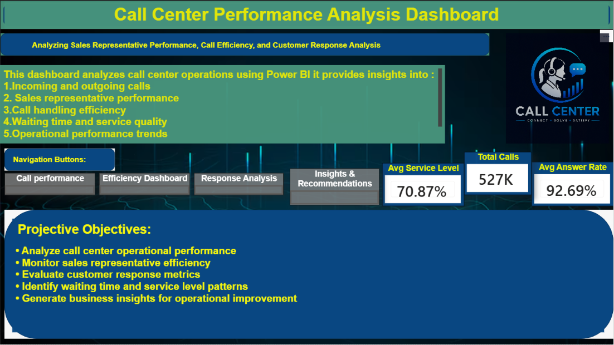
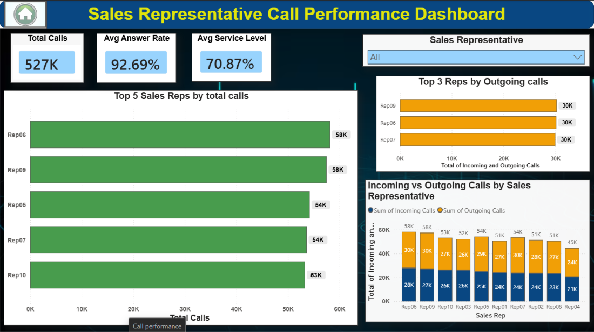
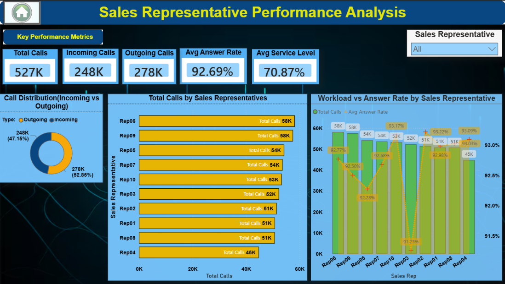
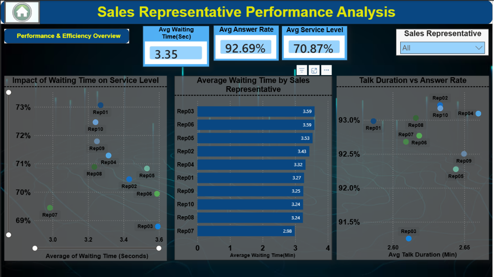
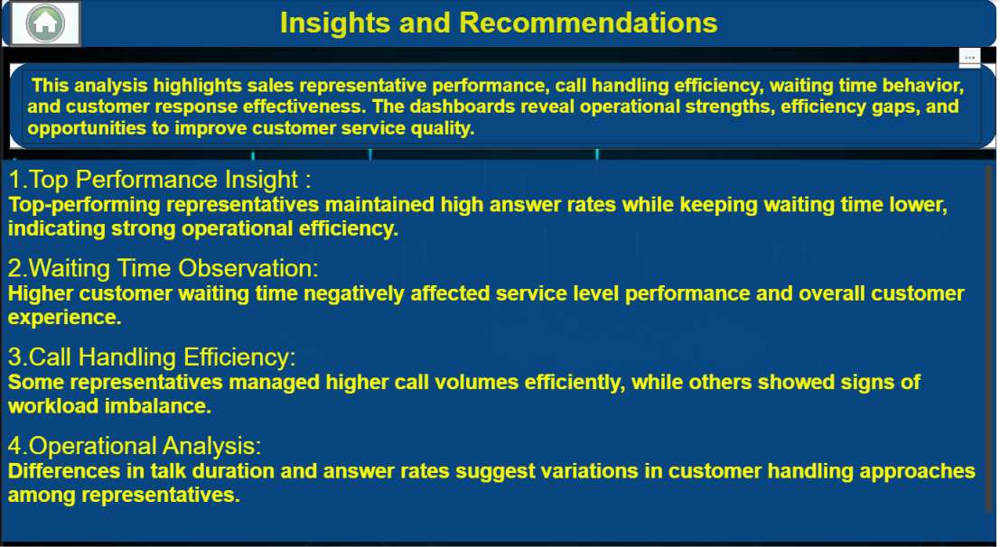

# 📞 Call Center Performance Analysis Dashboard using Power BI

An interactive Power BI dashboard designed to analyze call center operations, monitor sales representative performance, evaluate service efficiency, and generate actionable business insights through dynamic visualizations and KPIs.

---
# Developed By

**Viraj Waikar**

---
# Project Overview

This project presents an interactive Call Center Performance Dashboard developed using Microsoft Power BI.

The dashboard analyzes operational performance, customer response metrics, service efficiency, and sales representative performance through multiple interactive report pages.

It enables decision-makers to monitor KPIs, identify operational bottlenecks, improve customer satisfaction, and optimize overall call center performance using data-driven insights.

---
# Business Problem

Call centers handle thousands of customer interactions daily. Without proper reporting and visualization, it becomes difficult to monitor agent performance, service quality, response efficiency, and operational trends.

This dashboard transforms raw operational data into an interactive reporting solution that enables managers to monitor KPIs, identify performance gaps, and make informed business decisions.

---
# Project Objectives

The primary objective of this project is to analyze call center operations and improve business performance by providing interactive insights into:

- Call center operational performance
- Sales representative performance
- Customer response analysis
- Call handling efficiency
- Waiting time and service level trends
- Business recommendations for operational improvement

---
# Dataset Information

The dashboard is built using historical call center operational data.

### Dataset includes:

| Column | Description |
|---------|-------------|
| Call ID | Unique call identifier |
| Representative | Sales representative handling the call |
| Customer | Customer information |
| Call Type | Incoming / Outgoing |
| Response Time | Time taken to answer |
| Waiting Time | Customer waiting duration |
| Service Level | Service efficiency metrics |
| Call Outcome | Call resolution details |
| Customer Satisfaction | Customer feedback metrics |

---

# Dashboard Preview



---

## 📞 Call Performance Dashboard



This page provides an overview of call volumes, representative performance, and operational KPIs.

**Key Insight:** Managers can monitor overall call activity and evaluate representative productivity.

---

## ⚡ Efficiency Dashboard



This dashboard evaluates operational efficiency using service level, answer rate, and waiting time metrics.

**Key Insight:** Helps identify service bottlenecks and improve customer experience.

---

## 📊 Response Analysis



This page analyzes customer response metrics and call handling effectiveness.

**Key Insight:** Supports better customer service management and response optimization.

---

## 💡 Insights & Recommendations



This section summarizes important business findings and provides actionable recommendations based on dashboard analysis.

**Key Insight:** Enables management to make strategic operational improvements using data-driven recommendations.

---

# 📌 Key Performance Indicators (KPIs)

The dashboard monitors several important business KPIs, including:

- Total Calls Handled
- Answered Calls
- Missed Calls
- Average Response Time
- Average Waiting Time
- Service Level
- Customer Satisfaction
- Sales Representative Performance
- Call Resolution Rate

---

# 📊 Business Questions Solved

This dashboard helps answer several important business questions, including:

- How many calls were handled during the reporting period?
- Which sales representatives performed the best?
- What is the average customer response time?
- How efficient is the call center operation?
- What is the service level performance?
- Which representatives require performance improvement?
- What operational improvements can increase customer satisfaction?
- What business recommendations can improve overall call center efficiency?

---

# 💡 Key Business Insights

The dashboard provides valuable operational insights, including:

- Representative performance can be monitored using interactive KPIs.
- Service level analysis highlights opportunities to improve customer experience.
- Response time analysis helps identify operational bottlenecks.
- Call handling efficiency supports workforce optimization.
- Customer interaction metrics help improve service quality.
- Business recommendations assist management in making data-driven decisions.
- Interactive filtering enables deeper analysis across different operational dimensions.
- The dashboard supports continuous performance monitoring and operational improvement.

---

# ⚙️ Power BI Features Used

This project demonstrates practical business intelligence skills using Microsoft Power BI.

### Features Used

- Data Cleaning
- Data Modeling
- Power Query
- Interactive Dashboards
- KPI Cards
- Slicers
- Navigation Buttons
- Bookmarks
- Drill-through Navigation
- Tooltip Pages
- Custom Visualizations
- Business Intelligence Reporting

---

# 🧮 DAX Measures Used

The dashboard uses DAX (Data Analysis Expressions) to calculate dynamic business metrics and KPIs.

Examples include:

- Total Calls
- Average Response Time
- Service Level
- Average Waiting Time
- Performance Metrics
- Dynamic KPI Calculations

---

# 💻 Technologies Used

- Microsoft Power BI
- Power Query
- DAX
- Data Modeling
- CSV Dataset
- Interactive Dashboards
- Business Intelligence
- Data Visualization

---

# 📂 Project Structure

```text
Call-Center-Performance-Dashboard-PowerBI/
│
├── README.md
├── LICENSE
├── Call_center_project_sol.pbix
│
├── dataset/
│   └── Call Center Data.csv
│
└── images/
    ├── 01_intro_dashboard.png.png
    ├── 02_call_performance.png.png
    ├── 03_efficiency_dashboard.png.png
    ├── 04_response_analysis.png.png
    └── 05_insights_recommendations.png.png
```
# 🚀 How to Use

1. Download the repository.
2. Open the **Call_center_project_sol.pbix** file using Microsoft Power BI Desktop.
3. Refresh the dataset if required.
4. Navigate through the report pages using the built-in navigation buttons.
5. Apply filters and slicers to perform interactive analysis.
6. Review the Insights & Recommendations page for key business findings.

---

# 🎯 Skills Demonstrated

### Technical Skills

- Power BI Dashboard Development
- Data Cleaning
- Data Modeling
- DAX
- Power Query
- Interactive Reporting
- KPI Design
- Business Intelligence
- Data Visualization

### Business Skills

- Call Center Performance Analysis
- Operational KPI Monitoring
- Customer Service Analysis
- Representative Performance Evaluation
- Business Reporting
- Decision Support
- Operational Improvement

---

# 📝 Conclusion

This project demonstrates how Microsoft Power BI can be used to transform operational call center data into an interactive business intelligence solution.

Through multiple dashboard pages, KPI monitoring, interactive navigation, and analytical visualizations, the report enables managers to monitor operational performance, evaluate representative productivity, improve customer service, and make informed business decisions using real-time insights.

---

# 📬 Connect With Me

**GitHub**

https://github.com/Viraj088889999

---
